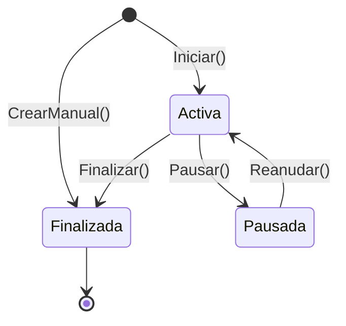

# Arquitectura de Plani

> Documento de referencia de la arquitectura **real** del proyecto. Describe cómo está
> construido hoy y las convenciones que rigen el trabajo. Si una decisión futura contradice
> este documento, primero se actualiza el documento.

## 1. Estilo arquitectónico

Plani es un **monolito ASP.NET Core MVC de proyecto único, organizado en capas (N-layer), con
patrón _Manager_** — una capa de servicio activa que combina lógica de negocio y acceso a datos
(Service + Repository fusionados sobre EF Core) — **y un núcleo de dominio en enriquecimiento
progresivo**: la entidad `Sesion` es el ejemplar rico (con factorías, transiciones y guardas);
el resto de las entidades son todavía anémicas y migran gradualmente.

**Lo que NO es (para evitar malentendidos):**
- **No es Clean Architecture.** No hay inversión de dependencias hacia un dominio aislado, ni
  proyectos separados por capa. (El README histórico afirmaba "Clean Architecture" — es incorrecto.)
- **No hay patrón Repository** explícito: los Managers hablan directo con `DbContext`.
- **No hay AutoMapper ni MediatR.** El mapeo es explícito (`ToEntity()` + constructores de ViewModel);
  ver §10 para el porqué.

Es una arquitectura sólida y coherente para el tamaño del proyecto. El objetivo no es reescribirla,
sino documentarla y hacerla evolucionar de forma consistente.

## 2. Diagrama de capas

```mermaid
flowchart TD
    Nav[Navegador] -->|HTTP| Ctrl["Controllers (6)<br/>HTTP-only, sin DbContext"]
    Ctrl -->|model.ToEntity()| VM["ViewModels<br/>binding + ToEntity()"]
    Ctrl -->|render| Views["Views Razor (57)<br/>+ 4 ViewComponents"]
    Ctrl -->|delega negocio + datos| Mgr["Managers (8)<br/>validación cross-entity,<br/>queries, dropdowns,<br/>tuplas de resultado"]
    Mgr -->|invariantes/transiciones| Dom["Dominio (Models/Domain)<br/>Base: auditoría + soft-delete<br/>Sesion: entidad rica"]
    Mgr -->|EF Core| Ctx["ApplicationDbContext<br/>IdentityDBContext<br/>filtros globales !IsDeleted"]
    Ctx -->|database-first| DB[("SQL Server (Azure)<br/>esquema en SQL/, sin EF migrations")]
```

**Capas:**
- **Presentación** — `Controllers/` (6, delgados, sin acceso a `DbContext`), Razor `Views/` (57) +
  `ViewModels/` (uno por grupo de entidad, con constructor que acepta la entidad + `ToEntity()`),
  y 4 `ViewComponents` (NavigationSidebar, Topbar, Breadcrumbs, UserHeader).
- **Negocio + Datos** — `Models/Managers/` (8). Cada Manager encapsula validaciones (reglas
  cross-entity), consultas (cadenas `Include`), dropdowns (`ObtenerParaDropdownAsync`) y devuelve
  tuplas de resultado `(bool Success, T Data, string Error)`.
- **Dominio** — `Models/Domain/`. Clase `Base` con auditoría (`CreatedBy`, `DateCreated`, …) y
  soft-delete (`IsDeleted`, setters privados, `Eliminar`/`RegristrarCreacion`/`RegistrarActualizacion`).
  `Sesion` es rica; el resto anémicas (ver §10 el plan de enriquecimiento).
- **Datos** — `ApplicationDbContext` + `IdentityDBContext` (misma cadena de conexión), database-first,
  con filtros globales `HasQueryFilter(e => !e.IsDeleted)`. El esquema vive en scripts SQL numerados en
  `SQL/`; **no se usan EF migrations**.
- **Identity** — `Identity/`: `ApplicationUser`/`ApplicationRole` + managers custom, auth por cookie,
  errores localizados a es-ES.

## 3. Las 10 reglas (convenciones normativas)

1. **Los Controllers NUNCA tocan `DbContext`.** Solo los Managers acceden a datos. `BaseController`
   es exclusivamente HTTP/auth (helpers de `ModelState`, roles, `GetCurrentUser`, redirects).
2. **Los POST reciben ViewModels, nunca entidades de dominio.** El controller llama `model.ToEntity()`
   y le pasa la **entidad de dominio** al Manager. *(Pendiente: 8 métodos de manager todavía reciben el
   ViewModel — TipoCliente en `ClientesManager`; Crear/Actualizar en Servicios/Areas/Modalidades — se
   unifican en el roadmap de dominio.)*
3. **Dominio rico donde hay comportamiento** (ejemplar: `Sesion`): factorías + métodos de intención con
   guardas que lanzan; las reglas cross-entity quedan en el Manager; el instante `ahora` se inyecta como
   parámetro para testabilidad. Ver §5 y §6.
4. **Las Views usan ViewModels, nunca entidades de dominio.** Los ViewModels tienen constructor que
   acepta la entidad + constructor sin parámetros para el binding de MVC.
5. **Los datos de dropdown salen de los Managers de dominio** (`ObtenerParaDropdownAsync`), no de
   `BaseController`.
6. **Los Managers devuelven tuplas de resultado**; la normalización de entrada (ej. `Trim`) vive en el
   Manager, antes de tocar la entidad rastreada.
7. **`ClientesController` está organizado por ÁREA DE NEGOCIO** (Clientes→Contratos→Proyectos→
   Asignaciones→Sesiones = la cadena de servicio que se le presta a un cliente). **Decisión intencional
   — no proponer dividirlo por entidad.**
8. **Un test class por Manager**; helpers `TestDatabase`/`TestSeeder`; patrón de dos contextos InMemory
   para los tests de `Include`. Ver §7.
9. **Sin `BaseManager`** (composición sobre herencia: las dependencias se inyectan por DI, no se heredan).
   **Sin Repository sobre EF. Sin AutoMapper.** Ver §10.
10. **Límite: máximo 2 sesiones no finalizadas** (Activa o Pausada) por usuario. **Decisión intencional.**
    (Si algún comentario en el código dice "1", es drift — la regla es 2.)

## 4. ¿Manager o Dominio? Cómo conviven

La duda natural es "si la entidad tiene la lógica, ¿para qué el Manager?". No compiten: **viven en capas
distintas y son complementarios**. El Manager es la capa de aplicación (orquesta y persiste); la entidad
rica es la capa de dominio (protege sus propios invariantes). El dominio rico **no elimina** al Manager,
lo **adelgaza**.

### Regla de reparto
Ante cualquier pieza de lógica preguntarse: *"¿esto lo puede decidir la entidad mirándose solo a sí misma?"*

| Va en la ENTIDAD (dominio) | Va en el MANAGER (aplicación) |
|---|---|
| Invariantes de sí misma ("no puedo pausar si no estoy activa") | Reglas que consultan **otras** tablas ("¿este usuario ya tiene 2 sesiones?") |
| Transiciones de su propio estado (`Pausar`, `Finalizar`) | Cargar/guardar (`DbContext`, `SaveChanges`, `Include`) |
| Cálculos sobre sus propios datos (acumular tiempo) | Transacciones y orquestación de varios agregados |
| Garantizar que nace en estado válido (factoría/constructor) | Unicidad de nombre (mira toda la tabla) y existencia de FKs |
| | Traducir la excepción de dominio → tupla `(false, mensaje)` |

### Trace anotado (ya implementado en `Sesion`)
```
SesionesManager.PausarSesion(idSesion, idColaborador, ...)      ← APLICACIÓN (Manager)
├─ carga la sesión con sus logs (DbContext, scoped al dueño)    ← persistencia + regla de acceso: manager
├─ sesion.Pausar(descripcion, usuario, ahora)  ────────────────► DOMINIO (entidad)
│     ├─ if (Estado != Activa) throw InvalidOperationException  ← invariante propio: entidad
│     ├─ calcula el tiempo del tramo desde el último Inicio/Reanudación  ← cálculo propio: entidad
│     └─ crea su SesionLog, cambia su Estado                    ← muta su propio estado: entidad
├─ catch (InvalidOperationException) → (false, ex.Message)      ← traducción a resultado: manager
└─ SaveChanges()                                                 ← persistencia: manager
```

El Manager **orquesta**; la entidad **decide sus invariantes**. Esta es la guía para enriquecer futuras
entidades: mover al dominio solo lo que una entidad puede decidir sobre sí misma.

## 5. Flujo de una petición CRUD típica

**GET `/Servicios/Areas`** (listado):
`ServiciosController.Areas()` → `AreasManager.ObtenerTodasAsync()` (con `AsNoTracking`, proyecta a
`AreaListViewModel`) → View.

**POST crear área** (patrón general de creación):
1. Model binding a `AgregarAreaViewModel`.
2. `if (!ModelState.IsValid)` → recargar dropdowns y re-render con errores.
3. `model.ToEntity()` construye la entidad de dominio.
4. `manager.CrearAsync(entidad, GetCurrentUser())` valida reglas cross-entity, hace `RegristrarCreacion`,
   persiste, y devuelve `(Success, Data, Error)`.
5. Éxito → `RedirectToAction`; error → `ModelState.AddModelError(error)` + re-render.

## 6. Máquina de estados de Sesión



- Creación solo por factoría (`Sesion.Iniciar` / `Sesion.CrearManual`): la sesión nace en estado válido.
- Cada transición protege su invariante y lanza `InvalidOperationException` si se viola (ej. pausar una
  sesión no activa, finalizar una pausada, finalizar una ya finalizada).
- El instante `ahora` se pasa como parámetro (no `DateTime.UtcNow` interno) → lógica de tiempo determinista
  y testeable sin base de datos.
- El **cálculo de tiempo** (acumular el tramo desde el último Inicio/Reanudación) vive dentro de la entidad;
  cada transición genera su `SesionLog` de auditoría.
- El **límite de 2 sesiones no finalizadas** por usuario es una regla cross-entity → se valida en el
  `SesionesManager` (consulta las sesiones del usuario), no en la entidad.

## 7. Modelo de datos

Cadena de servicio (el negocio): un **Cliente** (empresa atendida) tiene **Contratos**; cada Contrato tiene
**Proyectos**; a un Proyecto se le hacen **Asignaciones** de colaboradores; sobre una asignación se registran
**Sesiones** de trabajo.

```
Cliente ─1:N─ Contrato ─1:N─ Proyecto ─1:N─ Asignacion ─(colaborador)
                                    │
                                    └────── Sesion ─1:N─ SesionLog
Catálogos:  Area, Servicio, Modalidad, TipoCliente
Identity:   ApplicationUser, ApplicationRole
```

- `Base` provee a todas las entidades de dominio: `Id`, auditoría (`CreatedBy`/`DateCreated`/`UpdatedBy`/
  `DateUpdated`/`DeletedBy`/`DateDeleted`) y soft-delete (`IsDeleted`) con setters privados.
- Filtros globales `!IsDeleted`: las consultas nunca ven filas borradas lógicamente.

## 8. Estrategia de pruebas

- **xUnit + EF Core InMemory.** Proyecto `Source/plani.Tests`.
- **Una clase de test por Manager** (`AreasManagerTests`, `ColaboradoresManagerTests`, …). Los tests de la
  entidad rica (`SesionTests`) no necesitan base de datos.
- **Helpers**: `TestDatabase` (store InMemory aislado por instancia, `NuevoContexto()`) y `TestSeeder`
  (un método por entidad: recibe el `DbContext` + FKs requeridas + overrides opcionales; hace `Add` y
  devuelve la entidad; el test hace un solo `SaveChanges`).
- **Patrón de dos contextos para tests de `Include`**: seedear con un contexto y consultar con otro fresco.
  El provider InMemory solo hace fix-up de navegaciones dentro del mismo contexto; con contextos separados,
  una navegación solo queda cargada si el query tiene un `Include` real. Sin esto, los tests de `Include`
  serían falsos positivos (verificado empíricamente).
- **Gate**: `dotnet build Source/` + `dotnet test` verdes en cada frontera de fase.

## 9. Cambios de base de datos (database-first)

1. Escribir un script SQL numerado nuevo en `SQL/` (siguiente número disponible; ej. `007_*.sql`),
   idempotente cuando sea posible (`IF NOT EXISTS` / `IF COL_LENGTH` guards).
2. Aplicarlo manualmente a la base (dev primero, luego prod). Los scripts deben ser forward-compatible:
   el código viejo debe seguir funcionando tras aplicar el script.
3. Ajustar la entidad + la configuración en `ApplicationDbContext`/`IdentityDBContext`.
4. **Prohibido** `dotnet ef migrations` — el esquema se gobierna por los scripts de `SQL/`.

## 10. Tradeoffs aceptados (decisiones YAGNI)

Cada uno es una decisión deliberada, no una omisión:

- **Sin Repository sobre EF** — `DbContext` ya es un Unit of Work + repositorio genérico; una capa extra
  sería ceremonia.
- **Sin AutoMapper** — licencia comercial desde 2025 y, sobre todo, las entidades tienen comportamiento
  (setters privados, `Actualizar`, factorías) que un mapeo por convención estropearía. El mapeo explícito
  (`ToEntity()` + constructores de ViewModel) es más claro y seguro en compilación.
- **Sin `BaseManager`** — no hay comportamiento compartido entre managers, solo dependencias; DI las
  inyecta explícitamente (composición sobre herencia).
- **Export Excel (ClosedXML) vive en los Managers** (`SesionesManager`, `ProyectosManager`) — solo hay 2
  sitios; se extraería un helper solo si aparece un tercero.
- **Email inline en `ProyectosManager.CrearAsignacionAsync`** — el fallo del envío se registra pero no
  bloquea la asignación; no se abstrae un `INotificador` hasta que haya un segundo caso de uso.
- **Búsquedas `ToLower().Contains(...)` no-SARGables** — aceptable a la escala actual de datos.
- **Sin paginación server-side** — DataTables pagina en el cliente; se revisará solo si alguna vista supera
  volúmenes que degraden la carga.
- **Normalización (`Trim`) en los Managers**, no en las entidades — punto único de sanitización de entrada.
- **`ClientesController` no se divide** (ver regla 7).

---

*Última revisión: alineado con el estado del repo tras el refactor de controllers (sin `DbContext`) y la
Fase 1 del dominio rico de `Sesion`.*
